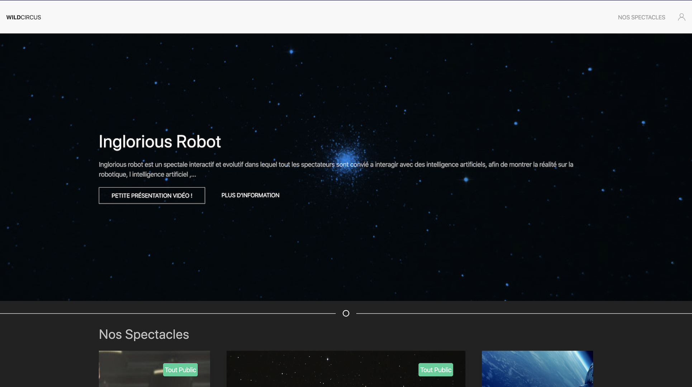

# Last Checkpoint at Wild Code School 

## Introduction 
Before the beginning of my training at _Wild Code School_ every one needs to create a *Wild Circus*   
This was one of my first web site, learning by my self and found every informations alone.  
It was a _Static_, Basic website.   
We've got 2 days to realise this chalange... you can see it just [right here](https://codepen.io/cyanurzz/pen/wOvKmP)    
As you can see in About Us we've got a video,... I programming the robot and also try to make a funny and different presentation (Thank's to _Cozmo_ an IA code with python and all libraries open) 
It look's like this :


Not beautiful ...

After Five month at the _Wild Code School_ they ask us for our last checkpoint to recreate as we want the *Wild Circus* without any constraint. 

So I built this app in less 48h hours.

With UserName `SuperAdmin` and password `admin`


## Manual 

### Requirements

For building and running the application you need:

- [MySql](https://www.mysql.com/fr/)    
      - create database called `wildb`    
      - a user `wildadmin`  
      - password : `wildAdmin666%`
- [JDK 11](https://www.oracle.com/technetwork/java/javase/downloads/jdk11-downloads-5066655.html)
- [Maven 3](https://maven.apache.org)


### Running the application locally

There are several ways to run a Spring Boot application on your local machine. One way is to execute the `main` method in the `WildCircus2Application` class from your IDE.

Alternatively you can use the [Spring Boot Maven plugin](https://docs.spring.io/spring-boot/docs/current/reference/html/build-tool-plugins-maven-plugin.html) like so:

```shell
mvn spring-boot:run
```

